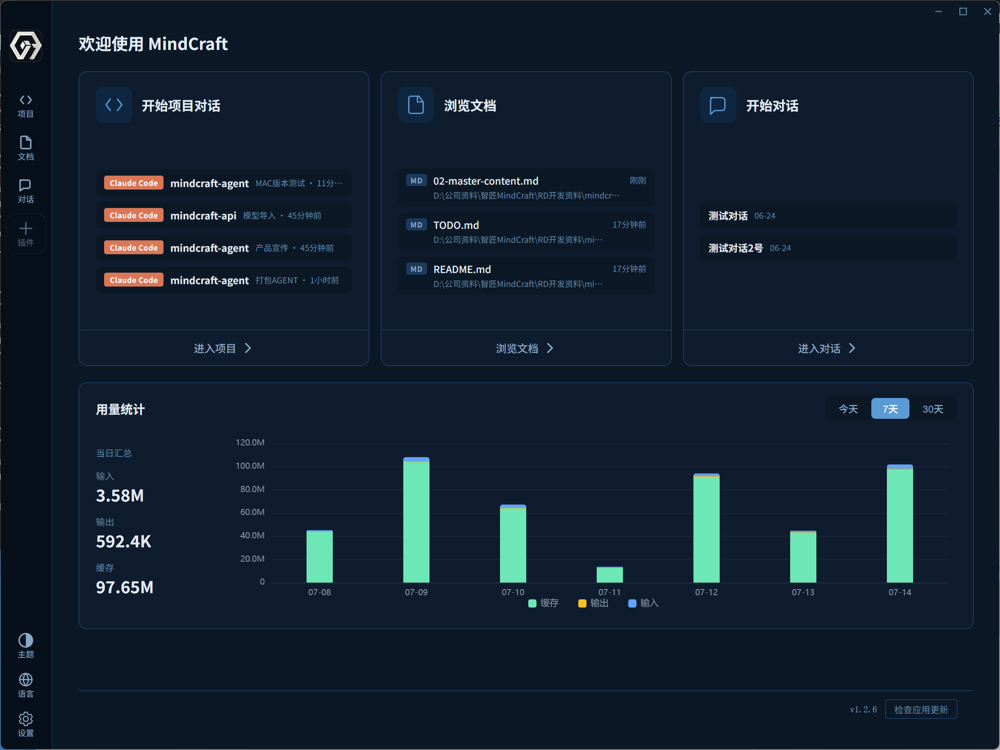
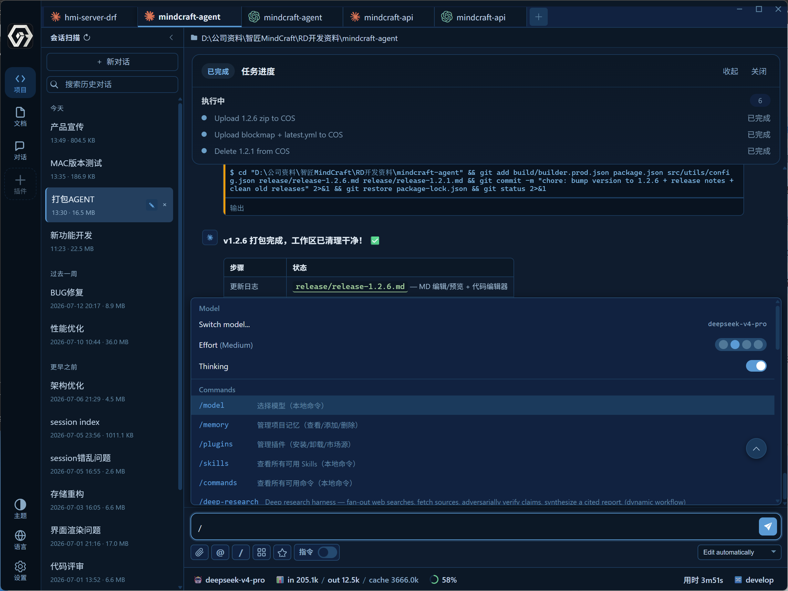
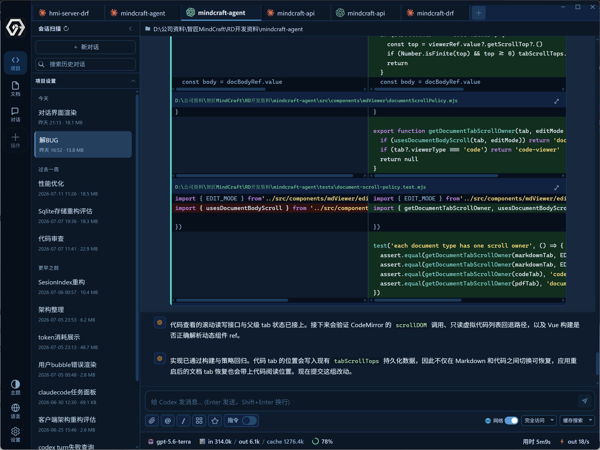
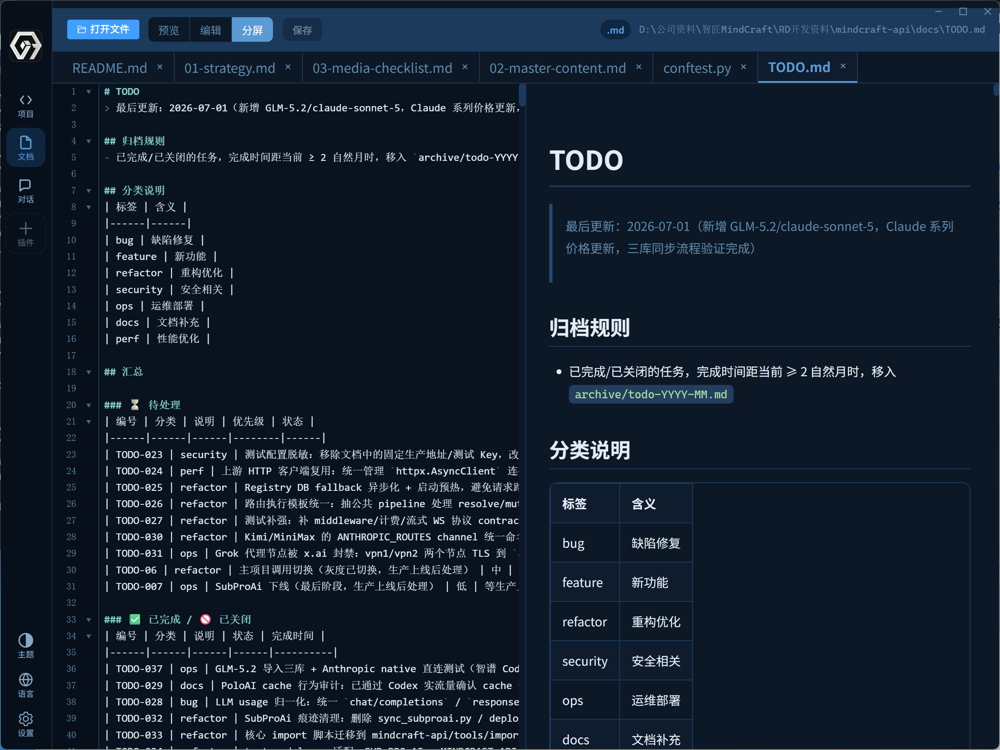

<p align="center">
  
</p>

<h1 align="center">MindCraft Agent</h1>

<p align="center">
  为 <strong>Claude Code</strong>、<strong>Codex</strong> 与软件项目打造的统一桌面开发工作区。
</p>

<p align="center">
  <a href="README.md">English</a> · <a href="README.zh-CN.md">简体中文</a>
</p>

<p align="center">
  <a href="https://github.com/MindCraft-HX/mindcraft-agent/blob/main/LICENSE"></a>
  
  
</p>

<p align="center">
  <a href="#快速开始">快速开始</a> · <a href="#工作区能力">产品能力</a> · <a href="docs/index.md">文档</a> · <a href="CONTRIBUTING.md">参与贡献</a>
</p>



<p align="center"><em>项目对话、文档工作、轻量 Chat 与用量洞察，汇集在同一个桌面工作区。</em></p>

## 为什么选择 MindCraft Agent？

AI 编程不应意味着在终端、不同 Provider 的窗口、项目笔记和文件 Diff 之间反复切换。MindCraft Agent 为 Claude Code 和 Codex 提供共享、理解项目上下文的桌面工作区，同时保留各自应有的运行时边界。

| | 你将获得 | 这意味着什么 |
| --- | --- | --- |
| **01** | **双 Agent，一个工作区** | 在 Claude Code 与 Codex 之间切换，不丢失项目上下文。 |
| **02** | **可见的开发闭环** | 查看流式回复、工具调用、任务进度、文件改动与 Diff。 |
| **03** | **清晰的会话边界** | 分离 UI 会话、Provider 线程和 Provider Transcript，避免身份混乱。 |
| **04** | **文档与代码并行工作** | 在应用内浏览、编辑、预览并链接 Markdown 或代码文件。 |

```text
Claude Code ─┐
             ├── MindCraft Agent ── 项目 · 会话 · Diff · 文档
Codex ───────┘
```

## 工作区能力

### 多 Agent 项目流程



<p align="center"><em>会话导航、任务进度、模型控制与斜杠命令，集中在一个专注的工作视图中。</em></p>

### 在上下文中审阅代码改动



<p align="center"><em>在会话中查看文件变更和 Diff，再直接继续与 Agent 协作。</em></p>

### 让文档始终在手边



<p align="center"><em>无需离开应用，即可编辑、预览和分屏浏览 Markdown 或代码文件。</em></p>

## 快速开始

### 环境要求

- Node.js 20+
- npm
- 已安装并完成认证的 Claude Code 和/或 Codex

### 从源码运行

```powershell
git clone https://github.com/MindCraft-HX/mindcraft-agent.git
cd mindcraft-agent
npm install
npm run dev
```

MindCraft Agent 会启动 Vite 与 Electron。运行数据存放在 Electron `userData`，不会写入仓库或 Provider Transcript 目录。

## 文档与贡献

| 你想了解 | 从这里开始 |
| --- | --- |
| 系统边界与架构 | [架构指南](docs/agent-architecture.md) |
| 会话恢复与问题排查 | [会话陷阱](docs/session-pitfalls.md) |
| 本地开发与打包 | [构建与发布指南](docs/build-and-deploy.md) |
| 全部工程文档 | [文档索引](docs/index.md) |
| 贡献与 Pull Request | [贡献指南](CONTRIBUTING.md) |
| 安全问题报告 | [安全策略](SECURITY.md) |

## 仓库结构

```text
packages/agent/  面向 renderer、Electron 与 preload 的共享 Agent 核心
src/             宿主壳层、路由、导航与仅宿主使用的视图
electron/        桌面运行时、窗口、文件系统集成与打包
tests/           单元、契约、回归与 Electron 冒烟测试
docs/            工程文档与项目决策
```

## 许可证

本项目采用 [MIT License](LICENSE) 开源。
